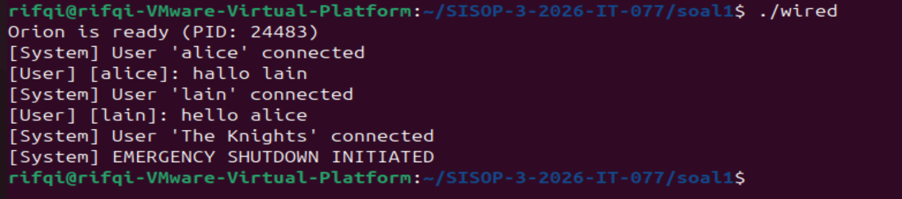
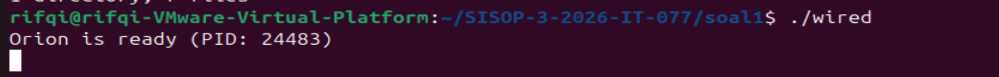
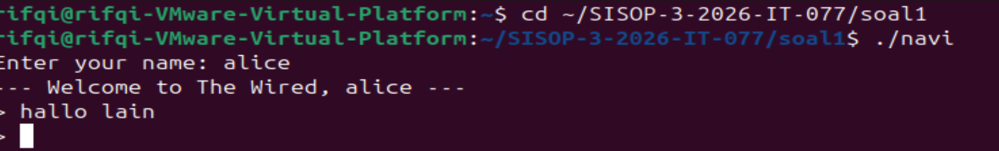
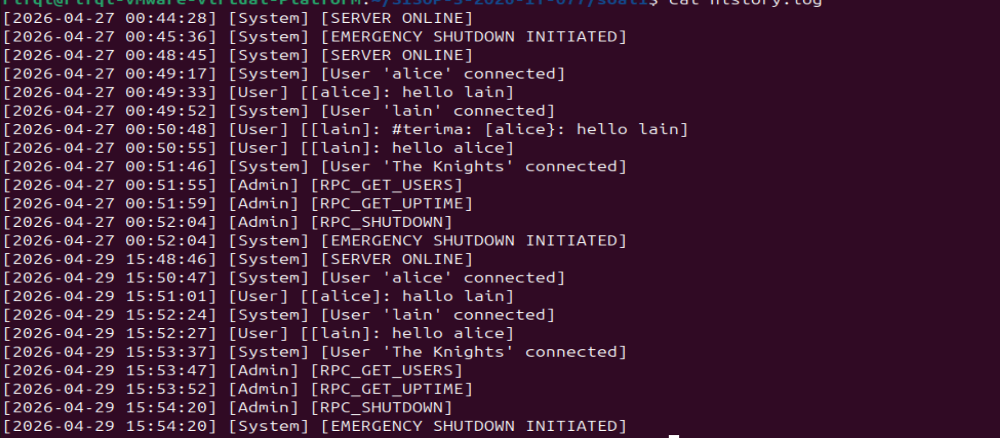

# SISOP-3-2026-IT-077

Rifqi Dwi Muslim | 5027251077

---

 
# Soal 1 — Present Day, Present Time
 
## Deskripsi Soal
 
Soal ini meminta pembuatan sistem komunikasi client-server bernama **The Wired**, yang terinspirasi dari serial Serial Experiments Lain. Sistem terdiri dari dua komponen utama:
 
- `wired.c`, server yang merepresentasikan jaringan The Wired
- `navi.c`, client yang merepresentasikan perangkat NAVI milik setiap pengguna
- `protocol.h`, modul bersama yang menangani definisi paket, logging, dan konfigurasi koneksi
Beberapa requirement utama yang harus dipenuhi:
 
1. Koneksi NAVI ke server harus dibaca dari **file protocol**, bukan hardcode
2. NAVI harus bisa mengirim dan menerima pesan secara **asinkron tanpa fork**
3. Server harus scalable, tidak boleh terblok oleh satu client yang lambat
4. Setiap NAVI harus punya **identitas unik** (tidak boleh ada nama duplikat)
5. Semua pesan yang berhasil dibroadcast harus tercatat di **history.log**
6. Ada entitas khusus bernama **The Knights** yang bisa mengakses prosedur jarak jauh (RPC), cek user aktif, uptime server, dan emergency shutdown, lewat autentikasi password, tanpa melalui jalur broadcast biasa
---
 
## Alur Pengerjaan
 
**1. Rancang `protocol.h` sebagai fondasi**  
Semua konstanta, tipe paket, struct `Packet`, dan implementasi fungsi logging serta konfigurasi koneksi disatukan dalam satu file header ini.
 
**2. Bangun server (`wired.c`)**  
Server dibangun menggunakan `select()` supaya bisa memantau banyak client sekaligus. Sistem registry `Soul[]` dibuat untuk tracking semua NAVI, dilengkapi broadcast, pengecekan duplikat nama, dan RPC The Knights.
 
**3. Bangun client (`navi.c`)**  
Client menggunakan 2 pthread — `recv_thread` dan `send_thread` — untuk async tanpa fork. Ada loop registrasi dengan retry otomatis dan mode sinkron khusus untuk The Knights.
 
**4. Testing**  
Diuji dengan beberapa terminal bersamaan — satu server, beberapa client biasa, dan satu The Knights.
 
---
 
## Penjelasan Kode
 
### `protocol.h` (Kontrak Komunikasi)
 
Semua definisi dan implementasi fungsi utilitas dipusatkan di satu file ini supaya konsisten antara server dan client.
 
```c
#define WIRED_PORT    7777
#define PROTOCOL_FILE "protocol.conf"
#define LOG_FILE      "history.log"
```
 
Tipe paket dibedakan lewat konstanta integer:
 
```c
#define PKT_REGISTER  1   // client daftar nama
#define PKT_CHAT      2   // pesan chat biasa
#define PKT_SYSTEM    3   // notifikasi dari server
#define PKT_EXIT      4   // client minta disconnect
#define PKT_RPC_REQ   5   // The Knights kirim perintah
#define PKT_RPC_REPLY 6   // balasan server ke The Knights
#define PKT_AUTH      7   // hasil autentikasi
```
 
Semua komunikasi dibungkus dalam satu struct:
 
```c
typedef struct {
    int  type;
    char from[MAX_NAME];
    char body[MAX_MSG];
} Packet;
```
 
Dengan struct ini, satu `send()` dan `recv()` bisa menangani semua jenis pesan, cukup baca field `type` untuk tahu harus diproses sebagai apa.
 
**`init_protocol()`** dipanggil server saat startup, menulis alamat dan port ke file `protocol.conf`. **`read_protocol()`** dipanggil client saat startup untuk membacanya, kalau file tidak ada, client fallback ke nilai default. **`write_log()`** mencatat setiap kejadian ke `history.log`:
 
```
[2026-04-26 19:06:40] [System] [SERVER ONLINE]
[2026-04-26 19:06:46] [System] [User 'alice' connected]
[2026-04-26 19:06:56] [User] [[alice]: hello lain]
```
 
---
 
### `wired.c` (Server (The Wired))
 
#### Registry "Souls"
 
Semua client yang terhubung disimpan dalam array struct:
 
```c
typedef struct {
    int  fd;
    char name[MAX_NAME];
    int  is_knights;
    int  active;
} Soul;
```
 
Field `is_knights` memisahkan The Knights dari user biasa tanpa perlu struct terpisah.
 
#### `select()` untuk Skalabilitas
 
Main loop server menggunakan `select()` untuk memantau semua file descriptor aktif sekaligus:
 
```c
while (1) {
    rfds = master;
    select(fdmax + 1, &rfds, NULL, NULL, NULL);
 
    for (int fd = 0; fd <= fdmax; fd++) {
        if (!FD_ISSET(fd, &rfds)) continue;
        if (fd == srv_fd)
            accept_soul(&master, &fdmax);
        else
            recv_from_soul(idx, &master);
    }
}
```
 
Kalau ada client yang lambat atau idle, server tidak terblok, `select()` langsung lanjut ke fd lain yang siap diproses.
 
#### Cek Nama Duplikat
 
Sebelum menerima NAVI baru, server cek dulu apakah nama sudah ada di registry:
 
```c
if (find_by_name(reg.from) >= 0) {
    push_packet(new_fd, PKT_SYSTEM, "System", "already synchronized...");
    close(new_fd);
    return;
}
```
 
#### Broadcast `shout()`
 
Pesan chat diteruskan ke semua client aktif, kecuali pengirim dan The Knights:
 
```c
static void shout(Packet *pkt, int skip_fd) {
    for (int i = 0; i < MAX_CLIENTS; i++) {
        if (!registry[i].active)       continue;
        if (registry[i].fd == skip_fd) continue;
        if (registry[i].is_knights)    continue;
        send(registry[i].fd, pkt, sizeof(Packet), 0);
    }
}
```
 
#### RPC The Knights
 
Server memproses tiga perintah RPC yang hanya bisa diakses The Knights:
 
| Perintah | Fungsi |
|---|---|
| `GET_USERS` | List semua NAVI aktif, Knights tidak dihitung |
| `GET_UPTIME` | Hitung selisih `time(NULL)` dengan `born_at` |
| `SHUTDOWN` | Broadcast ke semua client lalu `exit(0)` |
 
#### Signal Handler
 
Server menangkap `SIGINT` (Ctrl+C) lewat `signal(SIGINT, sigint_handler)`. Sebelum mati, server broadcast pesan shutdown ke semua client yang masih terhubung.
 
---
 
### `navi.c` (Client (NAVI))
 
#### Helper Kecil
 
```c
static void trim_newline(char *s) {
    s[strcspn(s, "\n")] = '\0';
}
 
static void show_prompt(void) {
    printf("> ");
    fflush(stdout);
}
```
 
`trim_newline()` dipanggil setiap kali ada input dari `fgets()`. `show_prompt()` dipusatkan ke satu fungsi supaya prompt konsisten di seluruh alur.
 
#### Loop Registrasi dengan Retry
 
Kalau nama ditolak server, client tidak langsung mati. Socket ditutup, `sleep(1)` dipanggil biar tidak spam connect, lalu loop balik ke awal:
 
```c
while (1) {
    sock_fd = socket(...);
    connect(...);
    if (strstr(resp.body, "already synchronized") || ...) {
        close(sock_fd);
        sleep(1);
        continue;
    }
    break;
}
```
 
#### 2 Thread Async
 
Setelah berhasil masuk, client spawn dua thread:
 
```c
pthread_create(&tid_recv, NULL, recv_thread, NULL);
pthread_create(&tid_send, NULL, send_thread, NULL);
```
 
- **`recv_thread`** — blocking di `recv()`, setiap ada paket masuk langsung print ke layar lalu tampilkan prompt `>` lagi
- **`send_thread`** — blocking di `fgets()`, setiap ada input kirim ke server via `push_packet()`
Main thread menunggu `send_thread` selesai (user ketik `/exit`), lalu cancel dan join `recv_thread` sebelum tutup socket.
 
#### Error Checking
 
Setiap `send()` dan `recv()` dicek return value-nya. Kalau gagal, ada pesan error yang ditampilkan sebelum program berhenti atau lanjut ke langkah berikutnya.
 
#### Mode The Knights (Sinkron)
 
The Knights tidak butuh thread karena tidak perlu menerima pesan dari orang lain secara bersamaan.
 
---
 
## Screenshot Output
 
**Server saat startup dan ada client masuk:**
 

 
**Client alice dan lain saling chat:**
 

 
**The Knights login dan eksekusi RPC:**
 

 
**Isi `history.log` setelah sesi berjalan:**
 

 
---
 
## Kendala
 
**1. Prompt `>` tertimpa pesan masuk**  
Waktu `recv_thread` menerima pesan dan langsung print, prompt `>` yang sudah ada di layar jadi ketimpa. Tetapi sudah berhasil solusinya dengan memanggil `show_prompt()` ulang setiap kali selesai print pesan masuk.
